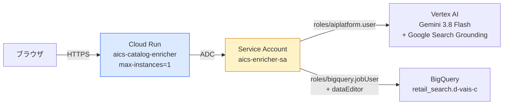

# Cloud Run デプロイ手順

AI Commerce Search Catalog Mapper & Enricher を Google Cloud Run 上で稼働させるための手順です。

---

## 1. 前提条件

| 項目 | 内容 |
|---|---|
| gcloud CLI | インストール済み・ログイン済み（Cloudtop では `/google/data/ro/teams/cloud-sdk/gcloud`） |
| GCP プロジェクト | `retail-search-jp-demo-minsoo`（環境変数 `PROJECT_ID` で変更可） |
| 権限 | プロジェクトに対する `roles/owner` または `run.admin` + `iam.serviceAccountAdmin` + `serviceusage.serviceUsageAdmin` |

```bash
# Cloudtop の場合、gcloud を PATH に通す
export PATH="/google/data/ro/teams/cloud-sdk:$PATH"

gcloud auth login --update-adc
gcloud config set project retail-search-jp-demo-minsoo
```

---

## 2. 最短手順（推奨）

```bash
cd /usr/local/google/home/minsoojun/work/catalog_enrichment_in_bigquery

# 実行されるコマンドを事前確認
./deploy_cloudrun.sh --dry-run

# 実際にデプロイ（API 有効化 → SA 作成 → IAM 付与 → ビルド → デプロイ）
./deploy_cloudrun.sh
```

スクリプトは **冪等** です。既存のサービスアカウントや有効化済み API があっても安全に再実行できます。

### よく使うオプション

```bash
# 社内向けに認証なしで公開する
ALLOW_UNAUTHENTICATED=true ./deploy_cloudrun.sh

# リージョンやサービス名を変更する
REGION=us-central1 SERVICE_NAME=my-enricher ./deploy_cloudrun.sh

# API 有効化と IAM 設定だけを先に済ませる
./deploy_cloudrun.sh --setup-only
```

---

## 3. デプロイ後の確認

```bash
SERVICE_URL=$(gcloud run services describe aics-catalog-enricher \
  --region=asia-northeast1 --format='value(status.url)')

# ヘルスチェック（スキーマ JSON がコンテナ内で解決できているかも確認できる）
# 注意: Cloud Run では GFE が "/healthz" を予約パスとして横取りするため "/api/health" を使う
curl -s -H "Authorization: Bearer $(gcloud auth print-identity-token)" \
  "${SERVICE_URL}/api/health" | python3 -m json.tool
```

期待される応答:

```json
{
  "status": "ok",
  "project_id": "retail-search-jp-demo-minsoo",
  "location": "global",
  "default_model": "gemini-3.8-flash",
  "schema_file": "/app/AI_Commerce_Search_Bigquery_schema.json",
  "schema_file_found": true,
  "active_datasets": 0,
  "active_jobs": 0
}
```

### ブラウザからアクセスする

既定では **認証必須**（`--no-allow-unauthenticated`）でデプロイされます。

```bash
# 方法 A: ローカルプロキシ経由（最も手軽・推奨）
gcloud run services proxy aics-catalog-enricher \
  --region=asia-northeast1 --port=8080
# → http://localhost:8080 を開く

# 方法 B: 特定ユーザーに Invoker 権限を付与
gcloud run services add-iam-policy-binding aics-catalog-enricher \
  --region=asia-northeast1 \
  --member='user:minsoojun@google.com' \
  --role='roles/run.invoker'
```

---

## 4. Cloud Run 構成の要点

このアプリ固有の事情により、以下の設定が**必須**です。

| フラグ | 値 | 理由 |
|---|---|---|
| `--max-instances` | **1** | アップロードしたデータセットとジョブ状態を**プロセス内メモリ**（`DATASETS` / `JOBS` dict）に保持しているため。複数インスタンスに分散すると「Dataset not found」が発生します |
| `--no-cpu-throttling` | — | 一括 Enrichment は `asyncio.create_task()` でリクエスト応答後もバックグラウンド実行されます。CPU が絞られると処理が停止します |
| `--timeout` | 3600 | 進捗ポーリングと大量データ処理に対応 |
| `--memory` / `--cpu` | 2Gi / 2 | 並列 Gemini 呼び出し（既定 5 並列）に対応 |
| `--execution-environment` | gen2 | 長時間のバックグラウンド処理の安定性向上 |
| `LOCATION` | **global** | `gemini-3.8-flash` は Vertex AI の `global` エンドポイントでのみ提供（`us-central1` では 404） |



---

## 5. サービスアカウントの権限

`deploy_cloudrun.sh` が `aics-enricher-sa` に以下を付与します（最小権限）。

| ロール | 用途 |
|---|---|
| `roles/aiplatform.user` | Gemini 生成 + Google Search Grounding の呼び出し |
| `roles/bigquery.jobUser` | BigQuery ロードジョブの作成 |
| `roles/bigquery.dataEditor` | 対象テーブルへの書き込み |

> [!TIP]
> より厳格に絞る場合は `roles/bigquery.dataEditor` をプロジェクト全体ではなく
> 対象データセット（`retail_search`）のみに付与してください。

---

## 6. CI/CD（Cloud Build トリガー）

`cloudbuild.yaml` を使うと、GitHub への push で自動デプロイできます。

```bash
# 手動実行
gcloud builds submit --config=cloudbuild.yaml

# GitHub 連携トリガーの作成例
gcloud builds triggers create github \
  --repo-name=catalog_enrichment_in_bigquery \
  --repo-owner=minsoojun-cloud \
  --branch-pattern='^main$' \
  --build-config=cloudbuild.yaml \
  --region=asia-northeast1
```

Cloud Build のサービスアカウントに以下の権限が必要です。

```bash
PROJECT_NUMBER=$(gcloud projects describe retail-search-jp-demo-minsoo --format='value(projectNumber)')
CB_SA="${PROJECT_NUMBER}@cloudbuild.gserviceaccount.com"

for ROLE in roles/run.admin roles/iam.serviceAccountUser roles/artifactregistry.writer; do
  gcloud projects add-iam-policy-binding retail-search-jp-demo-minsoo \
    --member="serviceAccount:${CB_SA}" --role="$ROLE" --condition=None
done
```

---

## 7. ローカルでのコンテナ動作確認（任意）

> [!NOTE]
> 現在の Cloudtop には Docker がインストールされていないため、この手順はスキップ可能です。
> `gcloud run deploy --source` は Cloud Build 上でビルドするため、ローカル Docker は不要です。

```bash
cd /usr/local/google/home/minsoojun/work/catalog_enrichment_in_bigquery
docker build -t aics-enricher .
docker run --rm -p 8080:8080 \
  -e PROJECT_ID=retail-search-jp-demo-minsoo \
  -e LOCATION=global \
  -v "${HOME}/.config/gcloud:/home/appuser/.config/gcloud:ro" \
  aics-enricher
```

---

## 8. 運用・トラブルシューティング

```bash
# ログ確認
gcloud run services logs tail aics-catalog-enricher --region=asia-northeast1

# 直近のリビジョン一覧
gcloud run revisions list --service=aics-catalog-enricher --region=asia-northeast1

# 1 つ前のリビジョンへロールバック
gcloud run services update-traffic aics-catalog-enricher \
  --region=asia-northeast1 --to-revisions=<REVISION_NAME>=100

# サービス削除
gcloud run services delete aics-catalog-enricher --region=asia-northeast1
```

| 症状 | 原因 / 対処 |
|---|---|
| `Dataset not found` が頻発 | インスタンスが複数起動している。`--max-instances=1` を確認 |
| 一括実行が途中で止まる | `--no-cpu-throttling` が未設定。再デプロイで付与 |
| Gemini が 404 `NOT_FOUND` | `LOCATION` が `global` 以外になっている（3.8-flash は global 限定） |
| `PERMISSION_DENIED` (Vertex AI) | サービスアカウントに `roles/aiplatform.user` が付与されているか確認 |
| BigQuery ロードが 403 | `roles/bigquery.jobUser` と `roles/bigquery.dataEditor` を確認 |
| 起動時に `MutualTLSChannelError` | Cloudtop 固有の事象。Cloud Run では発生しない（`config.py` が環境変数を無効化済み） |

---

## 9. 既知の制約

> [!WARNING]
> **状態はメモリ上にのみ保持されます。** アップロードしたデータセットとジョブ結果は
> インスタンス再起動（スケールイン、リビジョン更新、アイドルによる停止）で失われます。
> デモ・検証用途を想定した構成です。
>
> 永続化が必要な場合は以下の拡張を検討してください。
> - `DATASETS` / `JOBS` を Firestore または Cloud Storage へ退避
> - `--min-instances=1` でアイドル停止を防止（課金は増加）
> - 長時間バッチは Cloud Run Jobs / Cloud Tasks へ切り出し
