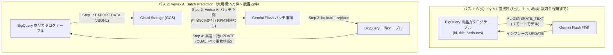

# BigQuery と Vertex AI (Gemini) による EC商品カタログ エンリッチメント

本リポジトリは、**Google Cloud Retail Search (AI Commerce Search / Vertex AI Search for Retail)** および **BigQuery** に格納されたEC商品カタログに対して、**Gemini** を活用して高品質な検索タグ（tags）を自動生成・一括反映するためのプロダクション向けエンリッチメント・パイプラインです。

日本のEC検索における表記揺れ（漢字、ひらがな、カタカナ、アルファベット・英語表記、連濁、口語・俗称、ブランド名）を網羅し、**検索再現率（Search Recall）の最大化**を実現します。

---

## アーキテクチャ概要

カタログの規模に応じて、以下の2つの処理パスを選択できます：



---

## 主な特長

- **検索再現率（Recall）の最適化**: 漢字、ひらがな、カタカナ、アルファベット、連濁（清音・濁音）、正式名称/俗称、用途・効能を網羅した検索タグ（2〜10件）を高精度に生成。
- **コスト50%削減 & APIレート制限の回避**: Vertex AI Batch Prediction を採用することで、通常のオンライン推論料金から**50%割引**が適用され、かつ分間クォータ（RPM/TPM 429エラー）を回避して大量処理が可能。
- **スキーマの完全互換性**: Google Cloud Retail API標準の `attributes` スキーマ（`ARRAY<STRUCT<key STRING, value STRUCT<text ARRAY<STRING>, numbers ARRAY<FLOAT64>>>>>`）を維持し、既存のカスタム属性を損なわずに `'tags'` のみを安全に追加・更新。
- **プロダクションレジリエンス（高信頼性設計）**:
  - **べき等性（Idempotency）**: 未タグ付けの商品のみを対象（`WHERE attributes IS NULL OR NOT EXISTS(...)`）とするため、途中で中断しても安全に再実行可能。
  - **重複排除の保証**: `QUALIFY ROW_NUMBER() = 1` により、BigQuery の `UPDATE/MERGE must match at most one source row` エラーを防止。
  - **リアルタイム費用監査**: バッチ結果の `usageMetadata` から、正確なトークン消費量とUSD費用を即時算出可能。

---

## リポジトリ構成

| ファイル名 | 説明 |
|---|---|
| [`vertex_ai_batch_prediction_guide_ja.md`](vertex_ai_batch_prediction_guide_ja.md) | **Vertex AI Batch Prediction 詳細実装ガイド（日本語）**。バッチ全体の設計、パラメータ設定、トラブルシューティングを詳述。 |
| [`update_enrichment_query.sql`](update_enrichment_query.sql) | BigQuery ML (`ML.GENERATE_TEXT`) を直接呼び出してインプレース更新するSQL。 |
| [`test_enrichment_query.sql`](test_enrichment_query.sql) | Gemini リモートモデル作成DDLおよびテスト用プレビューSELECTクエリ。 |
| [`submit_batch_job.py`](submit_batch_job.py) | Vertex AI Python SDK を使ってバッチ予測ジョブを投入する実行スクリプト。 |
| [`prompt.txt`](prompt.txt) | 日本語EC検索の形態素・表記揺れ展開に特化してチューニングされたプロンプトテンプレート。 |
| [`AI_Commerce_Search_Bigquery_schema.json`](AI_Commerce_Search_Bigquery_schema.json) | Google Cloud Retail Search 標準カタログの BigQuery スキーマ定義。 |
| [`data_mapping.md`](data_mapping.md) | 元カタログHTML/データ項目と Retail API スキーマ型のマッピング仕様書。 |

---

## クイックスタート: 大規模バッチパイプライン

### 前提条件

- 以下の Google Cloud API が有効化されていること：
  - BigQuery API (`bigquery.googleapis.com`)
  - Vertex AI API (`aiplatform.googleapis.com`)
  - Cloud Storage API (`storage.googleapis.com`)
- 入出力用の Cloud Storage バケットが存在すること。
- Retail API スキーマに準拠した BigQuery 商品テーブルが存在すること。

### 環境パラメータの設定

環境に合わせて以下のパラメータを設定してください：

| パラメータ名 | 設定例 | 説明 |
|---|---|---|
| `PROJECT_ID` | `retail-search-jp-demo-minsoo` | Google Cloud プロジェクトID |
| `DATASET_NAME` | `retail_search` | 対象 BigQuery データセット名 |
| `TABLE_NAME` | `d-vais-c` | 対象商品カタログテーブル名 |
| `BUCKET_NAME` | `catalog_enrichment_bigquery` | バッチ処理用 Cloud Storage バケット名 |
| `LOCATION` | `us-central1` | Vertex AI リージョン (`us-central1` または `us`) |
| `MODEL_NAME` | `gemini-2.5-flash` | 使用する Gemini モデル |

---

### Step 1: 未処理商品を Cloud Storage にエクスポート

BigQuery で以下のクエリを実行し、GCS上にバッチ推論用の JSONL を出力します。Vertex AI Gemini の公式仕様に準拠し、最上位に `"request"` オブジェクトを配置し、後続の突合用にプロンプト内に `- 商品ID:` を埋め込みます。

```sql
DECLARE bucket_name STRING DEFAULT 'catalog_enrichment_bigquery';

EXPORT DATA OPTIONS(
  uri=CONCAT('gs://', bucket_name, '/batch_input/products_*.jsonl'),
  format='JSON',
  overwrite=true
) AS
SELECT
  STRUCT(
    [
      STRUCT(
        'user' AS role,
        [
          STRUCT(
            CONCAT(
              """# 役割: Eコマース検索の専門家
# 目的: 日本のECユーザーが検索で使用するタグ（漢字、英語表記、ひらがな、カタカナ等）を網羅したJSONを出力
# ルール: 表記揺れ、連濁、俗称、英字を網羅し、2〜10個のタグを生成
# 出力形式: 必ず {"tags": ["タグ1", "タグ2", ...]} のJSON形式のみ出力
# 入力商品情報
- 商品ID: """, id, """
- タイトル: """, COALESCE(title, '')
            ) AS text
          )
        ] AS parts
      )
    ] AS contents,
    STRUCT(0.2 AS temperature, 2048 AS maxOutputTokens) AS generationConfig
  ) AS request
FROM
  `retail-search-jp-demo-minsoo.retail_search.d-vais-c`
WHERE
  title IS NOT NULL
  AND (attributes IS NULL OR NOT EXISTS(SELECT 1 FROM UNNEST(attributes) WHERE key = 'tags'));
```

---

### Step 2: Vertex AI Batch Prediction ジョブの投入

#### 選択肢 A: Python スクリプトで実行
[`submit_batch_job.py`](submit_batch_job.py) を実行します：
```bash
python3 submit_batch_job.py
```

#### 選択肢 B: REST API (`curl`) で直接実行
```bash
PROJECT_ID="retail-search-jp-demo-minsoo"
LOCATION="us-central1"
BUCKET_NAME="catalog_enrichment_bigquery"

curl -X POST \
  -H "Authorization: Bearer $(gcloud auth print-access-token)" \
  -H "Content-Type: application/json; charset=utf-8" \
  "https://${LOCATION}-aiplatform.googleapis.com/v1/projects/${PROJECT_ID}/locations/${LOCATION}/batchPredictionJobs" \
  -d "{
    \"displayName\": \"catalog-enrichment-batch\",
    \"model\": \"publishers/google/models/gemini-2.5-flash\",
    \"inputConfig\": {
      \"instancesFormat\": \"jsonl\",
      \"gcsSource\": {
        \"uris\": [\"gs://${BUCKET_NAME}/batch_input/products_*.jsonl\"]
      }
    },
    \"outputConfig\": {
      \"predictionsFormat\": \"jsonl\",
      \"gcsDestination\": {
        \"outputUriPrefix\": \"gs://${BUCKET_NAME}/batch_output/\"
      }
    }
  }"
```

#### 選択肢 C: Google Cloud コンソール（Web画面）から実行
1. **Vertex AI** > **バッチ予測 (Batch Predictions)** を開きます。
2. **作成 (CREATE)** をクリックし、モデル（`gemini-2.5-flash`）を選択します。
3. 入力元: `gs://catalog_enrichment_bigquery/batch_input/products_*.jsonl`
4. 出力先: `gs://catalog_enrichment_bigquery/batch_output/` を指定して **送信** をクリックします。

---

### Step 3: 予測結果を BigQuery 一時テーブルにロード

バッチ完了後、出力された JSONL を BigQuery の一時テーブルにロードします（重複防止のため `--replace=true` を指定）：

```bash
BUCKET_NAME="catalog_enrichment_bigquery"

# 最新の出力ファイルパスを変数に取得
OUTPUT_URI=$(gcloud storage ls "gs://${BUCKET_NAME}/batch_output/**/predictions*.jsonl" | tail -n 1)
echo "ロード対象ファイル: ${OUTPUT_URI}"

# BigQuery 一時テーブルへロード（上書きモード）
bq load \
  --project_id=retail-search-jp-demo-minsoo \
  --replace=true \
  --source_format=NEWLINE_DELIMITED_JSON \
  --autodetect \
  retail-search-jp-demo-minsoo:retail_search.temp_batch_prediction_results \
  "${OUTPUT_URI}"
```

---

### Step 4: 本番カタログテーブルへの一括 UPDATE

一時テーブルの結果から商品IDとタグ配列をパースし、重複を排除（`QUALIFY`）した上で本番テーブルの `attributes` に高速反映します：

```sql
UPDATE `retail-search-jp-demo-minsoo.retail_search.d-vais-c` AS target
SET attributes = ARRAY_CONCAT(
  -- 既存のattributesから'tags'以外の属性を保持
  ARRAY(
    SELECT AS STRUCT a.*
    FROM UNNEST(COALESCE(target.attributes, [])) AS a
    WHERE a.key != 'tags'
  ),
  -- 新規生成されたtags属性を追加 (key: 'tags', value.text: [...], value.numbers: [])
  [STRUCT(
    'tags' AS key,
    STRUCT(
      source.generated_tags AS text,
      CAST([] AS ARRAY<FLOAT64>) AS numbers
    ) AS value
  )]
)
FROM (
  SELECT
    -- プロンプト内のテキストから商品IDを抽出
    REGEXP_EXTRACT(
      request.contents[SAFE_OFFSET(0)].parts[SAFE_OFFSET(0)].text,
      r'- 商品ID:\s*([^\n\r]+)'
    ) AS id,
    -- レスポンステキストからタグ配列を抽出
    JSON_EXTRACT_STRING_ARRAY(
      TRIM(REGEXP_REPLACE(response.candidates[SAFE_OFFSET(0)].content.parts[SAFE_OFFSET(0)].text, r'^```(?:json)?|```$', '')),
      '$.tags'
    ) AS generated_tags
  FROM
    `retail-search-jp-demo-minsoo.retail_search.temp_batch_prediction_results`
  WHERE
    response.candidates[SAFE_OFFSET(0)].content.parts[SAFE_OFFSET(0)].text IS NOT NULL
  -- 重複レコードを排除し、各商品IDごとに最新1件に絞り込む（UPDATEエラー完全防止）
  QUALIFY ROW_NUMBER() OVER(PARTITION BY id ORDER BY processed_time DESC) = 1
) AS source
WHERE
  target.id = source.id
  AND source.generated_tags IS NOT NULL 
  AND ARRAY_LENGTH(source.generated_tags) > 0;
```

---

### Step 5: 反映結果の確認

本番テーブルの `attributes` にタグが正しく追加されたかを検証します：

```sql
SELECT 
  id, 
  title, 
  attributes 
FROM 
  `retail-search-jp-demo-minsoo.retail_search.d-vais-c`
WHERE 
  ARRAY_LENGTH(attributes) > 0
LIMIT 5;
```

---

## コストおよびトークン消費量の監査クエリ

バッチ完了後、結果テーブルの `usageMetadata` から実際のトークン数とUSD費用を即座に算出できます：

```sql
SELECT
  COUNT(*) AS total_processed_items,
  SUM(response.usageMetadata.promptTokenCount) AS total_input_tokens,
  SUM(response.usageMetadata.candidatesTokenCount) AS total_output_tokens,
  SUM(response.usageMetadata.totalTokenCount) AS grand_total_tokens,
  
  -- Gemini 2.5 Flash バッチ50%割引料金基準:
  -- 入力: $0.0375 / 100万トークン, 出力: $0.15 / 100万トークン
  ROUND(
    (SUM(response.usageMetadata.promptTokenCount) / 1000000.0 * 0.0375) +
    (SUM(response.usageMetadata.candidatesTokenCount) / 1000000.0 * 0.15),
    4
  ) AS estimated_cost_usd
FROM
  `retail-search-jp-demo-minsoo.retail_search.temp_batch_prediction_results`;
```

*目安: 商品データ 1,000件あたりの消費量は約30万〜40万トークンとなり、**約 $0.03 〜 $0.05（日本円で約5〜8円程度）**と極めて安価です。*

---

## トラブルシューティング

| エラー内容 / 現象 | 原因 | 対処法 |
|---|---|---|
| **`The lines in the specified input JSONL file must contain the "request" property.`** | Cloud Storage入力用JSONLの各行に、最上位の `"request"` ラッパーが存在しない。 | Step 1のSQLのように、`STRUCT(...) AS request` で囲んでエクスポートする。 |
| **`Not found: Uris gs://.../prediction.results-*.jsonl`** | Vertex AIが動的タイムスタンプフォルダを作成し、`bq load` がディレクトリ階層のワイルドカード(`*`)に対応していない。 | Step 3のように `OUTPUT_URI=$(gcloud storage ls ... \| tail -n 1)` で実際のパスを取得してロードする。 |
| **`UPDATE/MERGE must match at most one source row for each target row`** | `bq load` を複数回実行した等により、一時テーブル内に同一商品IDが重複蓄積している。 | Step 4のSQLに含まれている `QUALIFY ROW_NUMBER() OVER(...) = 1` を使用し、`bq load --replace=true` でロードする。 |
| **生JSONLで tags が見当たらない** | 生のJSONLでは、`response.candidates[0].content.parts[0].text` 内にJSON文字列としてエスケープ格納されている。 | 正常に出力されています。Step 4の `JSON_EXTRACT_STRING_ARRAY` を使ってBigQuery上で展開・抽出してください。 |

---

## 関連ドキュメント

- [Vertex AI Batch Prediction 公式ドキュメント](https://cloud.google.com/vertex-ai/generative-ai/docs/multimodal/batch-prediction-gemini)
- [Google Cloud Retail API カタログ属性 仕様](https://cloud.google.com/retail/docs/catalog)
- [詳細パイプライン実装ガイド (`vertex_ai_batch_prediction_guide_ja.md`)](vertex_ai_batch_prediction_guide_ja.md)
