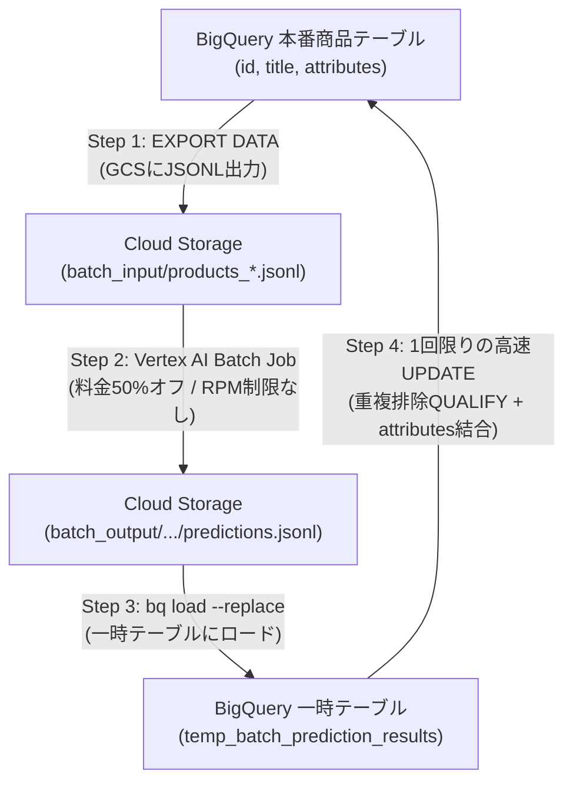

# 大規模商品カタログ向け Vertex AI Batch Prediction パイプライン実装ガイド

本ドキュメントは、数万件〜数十万件規模の商品カタログに対してGeminiを活用し、検索タグ（tags）を効率的かつ安価に生成・一括反映するための**Google Cloud公式推奨のバッチ処理パイプライン（Vertex AI Batch Prediction）**の汎用実装ガイドです。

---

## 1. なぜ Batch Prediction なのか？（オンライン処理との比較）

BigQueryの `ML.GENERATE_TEXT` を使ったリアルタイムクエリで数万件以上のデータを一度に処理しようとすると、以下の課題が発生します：

1. **APIクォータ制限（429 Rate Limit）**: Vertex AIの分間リクエスト上限（RPM/TPM）に抵触し、ジョブが中断・失敗する。
2. **クエリタイムアウト**: 数時間におよぶBigQueryのトランザクションがタイムアウトするリスク。
3. **コスト負担**: 通常のオンライン推論料金（100%）がそのまま適用される。

### Vertex AI Batch Prediction のメリット

| 項目 | オンライン推論 (`ML.GENERATE_TEXT`) | Vertex AI Batch Prediction |
|---|---|---|
| **コスト** | 通常料金（100%） | **50% 割引（半額）** |
| **APIクォータ** | 厳しいRPM/TPM制限あり（429エラーリスク） | **クォータ制限なし（キューイング処理）** |
| **安定性** | タイムアウトリスクあり | 障害時の自動リトライ・耐障害性あり |
| **適したデータ規模** | 数百〜数千件の即時処理 | **数万〜数百万件の一括処理** |

---

## 2. 全体アーキテクチャフロー



---

## 3. ステップ別 実装手順

### 事前準備: 環境パラメータの設定

本ガイドの各スクリプトおよびクエリで使用するパラメータ一覧です。環境に合わせて適宜変更してください：

| パラメータ名 | 説明 | 本デモでの設定値 |
|---|---|---|
| `PROJECT_ID` | Google CloudプロジェクトID | `retail-search-jp-demo-minsoo` |
| `DATASET_NAME` | BigQueryデータセット名 | `retail_search` |
| `TABLE_NAME` | 対象商品カタログテーブル名 | `d-vais-c` |
| `BUCKET_NAME` | Cloud Storageバケット名 | `catalog_enrichment_bigquery` |
| `LOCATION` | Vertex AIリージョン | `us-central1` （または `us`） |
| `MODEL_NAME` | 使用Geminiモデル | `gemini-2.5-flash` （または `gemini-3.6-flash`） |

> **スキーマ前提**:
> 対象テーブルには `id` (STRING), `title` (STRING), `attributes` (Google Cloud Retail API規格のRECORD/STRUCT配列) が存在することを前提としています。

---

### Step 1. 入力データの作成（BigQuery → GCS）

BigQueryから未処理（tags未登録）の商品のプロンプトを作成し、JSONLファイルとしてCloud Storageに出力します。
※ Vertex AI Geminiの公式仕様に準拠し、最上位に `"request"` オブジェクトを配置し、後続の突合用にプロンプト内に `- 商品ID:` を埋め込みます。

```sql
-- GCSバケット名をDECLARE変数で定義（環境に合わせて変更）
DECLARE bucket_name STRING DEFAULT 'catalog_enrichment_bigquery';

-- Cloud Storageにバッチ入力用JSONLをエクスポート
EXPORT DATA OPTIONS(
  uri=CONCAT('gs://', bucket_name, '/batch_input/products_*.jsonl'),
  format='JSON',
  overwrite=true
) AS
SELECT
  -- Vertex AI Gemini Batch Predictionが要求する 'request' 最上位オブジェクト
  STRUCT(
    [
      STRUCT(
        'user' AS role,
        [
          STRUCT(
            CONCAT(
              """# 役割
あなたはEコマース検索（AI Commerce Search / Retail Search）のインデックス最適化の専門家です。
ユーザーがどのような検索キーワード（表記揺れ、俗称、連濁など）を入力しても商品が確実にヒットするように、商品情報から検索用タグ（tags）を生成してください。

# 目的
入力された商品情報に基づき、日本のECユーザーが検索で使用する可能性の高いキーワード（漢字、英語表記、ひらがな、カタカナ等）を網羅した「検索タグ配列（JSON）」を出力してください。

# タグ生成ルール
以下の観点からキーワードを網羅し、2〜10個のタグを生成してください：
1. 表記揺れ網羅: 漢字、ひらがな、カタカナ、アルファベット・英語の各表記（例: 剃刀 / かみそり / カミソリ / razor）
2. 連濁・発音のバリエーション: 清音・濁音の揺れ（例: くちべに ↔ ぐちべに）
3. 正式名称と口語・俗称: 公的・一般的分類名と日常会話で使われる一般的な呼び方
4. ブランド・メーカー・略称: 正式ブランド名、略称、メーカー名（日英両表記）
5. 用途・効能・症状・対象: どのような悩み・目的・対象者・シーンで検索されるか
6. 形状・スペック: 剤形、容量、パッケージ特徴

# 出力形式
必ず以下のJSON形式のみを出力してください（Markdownコードブロックや解説は含めないでください）：
{"tags": ["タグ1", "タグ2", ...]}

# 入力商品情報
- 商品ID: """, id, """
- タイトル: """, COALESCE(title, '')
            ) AS text
          )
        ] AS parts
      )
    ] AS contents,
    STRUCT(
      0.2 AS temperature,
      2048 AS maxOutputTokens
    ) AS generationConfig
  ) AS request
FROM
  `retail-search-jp-demo-minsoo.retail_search.d-vais-c`
WHERE
  title IS NOT NULL
  -- まだタグが付与されていない商品のみを対象にする
  AND (attributes IS NULL OR NOT EXISTS(SELECT 1 FROM UNNEST(attributes) WHERE key = 'tags'));
```

---

### Step 2. Vertex AI Batch Prediction ジョブの実行

Cloud StorageにエクスポートされたJSONLを指定し、バッチ推論ジョブを実行します。

#### 選択肢 A: Python スクリプト (`submit_batch_job.py`)
```python
import vertexai
from vertexai.preview.batch_prediction import BatchPredictionJob

PROJECT_ID = "retail-search-jp-demo-minsoo"
LOCATION = "us-central1"
BUCKET_NAME = "catalog_enrichment_bigquery"
MODEL_NAME = "gemini-2.5-flash" # または "gemini-3.6-flash"

vertexai.init(project=PROJECT_ID, location=LOCATION)

job = BatchPredictionJob.submit(
    source_model=MODEL_NAME,
    input_dataset=f"gs://{BUCKET_NAME}/batch_input/products_*.jsonl",
    output_uri_prefix=f"gs://{BUCKET_NAME}/batch_output/",
    job_display_name="catalog-enrichment-batch",
)

print(f"Job submitted: {job.resource_name}")
print(f"Job state: {job.state}")
```

#### 選択肢 B: ターミナルから直接実行（REST API `curl`）
```bash
PROJECT_ID="retail-search-jp-demo-minsoo"
LOCATION="us-central1"
BUCKET_NAME="catalog_enrichment_bigquery"

curl -X POST \
  -H "Authorization: Bearer $(gcloud auth print-access-token)" \
  -H "Content-Type: application/json; charset=utf-8" \
  "https://${LOCATION}-aiplatform.googleapis.com/v1/projects/${PROJECT_ID}/locations/${LOCATION}/batchPredictionJobs" \
  -d "{
    \"displayName\": \"catalog-enrichment-batch\",
    \"model\": \"publishers/google/models/gemini-2.5-flash\",
    \"inputConfig\": {
      \"instancesFormat\": \"jsonl\",
      \"gcsSource\": {
        \"uris\": [\"gs://${BUCKET_NAME}/batch_input/products_*.jsonl\"]
      }
    },
    \"outputConfig\": {
      \"predictionsFormat\": \"jsonl\",
      \"gcsDestination\": {
        \"outputUriPrefix\": \"gs://${BUCKET_NAME}/batch_output/\"
      }
    }
  }"
```

#### 選択肢 C: Google Cloud コンソール（Web画面）から実行
1. [Vertex AI > バッチ予測 (Batch Predictions)](https://console.cloud.google.com/vertex-ai/batch-predictions?project=retail-search-jp-demo-minsoo) を開きます。
2. **作成 (CREATE)** をクリックします。
3. モデル名（`gemini-2.5-flash` 等）を選択します。
4. 入力元: `gs://catalog_enrichment_bigquery/batch_input/products_*.jsonl`
5. 出力先: `gs://catalog_enrichment_bigquery/batch_output/`
6. **送信** をクリックします。

---

### Step 3. 予測結果をBigQueryの一時テーブルにロード

バッチ予測が完了すると、`gs://${BUCKET_NAME}/batch_output/prediction-model-<TIMESTAMP>/predictions.jsonl` に結果が出力されます。
※ `bq load` はディレクトリ階層のワイルドカードに対応していないため、最新パスを取得し、重複ロードを防ぐため `--replace=true` を付与して実行します。

```bash
BUCKET_NAME="catalog_enrichment_bigquery"

# 1. 出力された最新の predictions.jsonl のパスを変数に取得
OUTPUT_URI=$(gcloud storage ls "gs://${BUCKET_NAME}/batch_output/**/predictions*.jsonl" | tail -n 1)
echo "ロード対象ファイル: ${OUTPUT_URI}"

# 2. BigQueryの一時テーブルへロード（上書きモード）
bq load \
  --project_id=retail-search-jp-demo-minsoo \
  --replace=true \
  --source_format=NEWLINE_DELIMITED_JSON \
  --autodetect \
  retail-search-jp-demo-minsoo:retail_search.temp_batch_prediction_results \
  "${OUTPUT_URI}"
```

---

### Step 4. 本番テーブルへの一括反映 (高速UPDATE)

一時テーブルの結果から商品IDとタグ配列をパースし、重複を排除（`QUALIFY`）した上で本番テーブルの `attributes` に反映します。推論処理は既に完了しているため、1,000件〜数万件の更新も**わずか数秒**で完了します。

```sql
UPDATE `retail-search-jp-demo-minsoo.retail_search.d-vais-c` AS target
SET attributes = ARRAY_CONCAT(
  -- 既存のattributesから'tags'以外の属性を保持
  ARRAY(
    SELECT AS STRUCT a.*
    FROM UNNEST(COALESCE(target.attributes, [])) AS a
    WHERE a.key != 'tags'
  ),
  -- 新規生成されたtags属性を追加 (key: 'tags', value.text: [...], value.numbers: [])
  [STRUCT(
    'tags' AS key,
    STRUCT(
      source.generated_tags AS text,
      CAST([] AS ARRAY<FLOAT64>) AS numbers
    ) AS value
  )]
)
FROM (
  SELECT
    -- requestのプロンプトテキストから商品IDを抽出
    REGEXP_EXTRACT(
      request.contents[SAFE_OFFSET(0)].parts[SAFE_OFFSET(0)].text,
      r'- 商品ID:\s*([^\n\r]+)'
    ) AS id,
    -- LLMのレスポンステキストからタグ配列を抽出
    JSON_EXTRACT_STRING_ARRAY(
      TRIM(REGEXP_REPLACE(response.candidates[SAFE_OFFSET(0)].content.parts[SAFE_OFFSET(0)].text, r'^```(?:json)?|```$', '')),
      '$.tags'
    ) AS generated_tags
  FROM
    `retail-search-jp-demo-minsoo.retail_search.temp_batch_prediction_results`
  WHERE
    response.candidates[SAFE_OFFSET(0)].content.parts[SAFE_OFFSET(0)].text IS NOT NULL
  -- 【重要】重複レコードを排除し、各商品IDごとに最新1件に絞り込む（UPDATEエラー完全防止）
  QUALIFY ROW_NUMBER() OVER(PARTITION BY id ORDER BY processed_time DESC) = 1
) AS source
WHERE
  target.id = source.id
  AND source.generated_tags IS NOT NULL 
  AND ARRAY_LENGTH(source.generated_tags) > 0;
```

---

### Step 5. 更新結果の確認（検証クエリ）

本番テーブルの `attributes` にタグが正しく追加されたかを確認します。

```sql
SELECT 
  id, 
  title, 
  attributes 
FROM 
  `retail-search-jp-demo-minsoo.retail_search.d-vais-c`
WHERE 
  ARRAY_LENGTH(attributes) > 0
LIMIT 5;
```

---

## 4. 大規模処理における最適化ベストプラクティス

1. **モデルの選定 (`gemini-2.5-flash` / `gemini-3.6-flash`)**:
   - 高度な日本語語彙力・表記揺れ展開力を備えたモデルを使用します。
   - バッチ推論を利用することで、思考トークンを含む推論でも分間制限（RPM）を気にせず、50%割引料金で安定処理できます。
2. **トークン数の削減**:
   - 入力は `title` のみを活用し、`description` は省略することで入力トークンを極小化。
   - タグ生成数を「2〜10個」に絞ることで、出力トークン数を最小化。
3. **べき等性（Idempotency）の確保**:
   - Step 1 の抽出条件に `WHERE attributes IS NULL OR NOT EXISTS(...)` を設けることで、未完了の商品のみを対象として安全に差分処理・再実行が可能です。

---

## 5. バッチ予測の費用・トークン消費量の確認方法

### 方法 1. BigQueryで即時算出（ジョブ完了直後に確認可能）

GCPの公式請求レポート（Billing Report）は反映までに4〜12時間程度かかりますが、バッチ結果テーブルの `usageMetadata` を利用することで、**BigQuery上で即座に正確なトークン数とUSD費用を算出**できます。

```sql
SELECT
  -- 総処理件数
  COUNT(*) AS total_processed_items,
  -- トークン消費合計
  SUM(response.usageMetadata.promptTokenCount) AS total_input_tokens,
  SUM(response.usageMetadata.candidatesTokenCount) AS total_output_tokens,
  SUM(response.usageMetadata.totalTokenCount) AS grand_total_tokens,
  
  -- [Gemini 2.5 Flash バッチ50%割引料金基準]
  -- 入力: $0.0375 / 100万トークン, 出力: $0.15 / 100万トークン
  ROUND(
    (SUM(response.usageMetadata.promptTokenCount) / 1000000.0 * 0.0375) +
    (SUM(response.usageMetadata.candidatesTokenCount) / 1000000.0 * 0.15),
    4
  ) AS estimated_cost_usd
FROM
  `retail-search-jp-demo-minsoo.retail_search.temp_batch_prediction_results`;
```

> **費用の目安（1,000件処理時）**:
> 1,000件の商品データ処理にかかる費用は、合計約30万〜40万トークンとなり、**約 $0.03 〜 $0.05（日本円で約5〜8円程度）**と極めて安価です。

### 方法 2. Google Cloud コンソールの「お支払い (Billing)」レポート

1. [Google Cloud Console > お支払い (Billing)](https://console.cloud.google.com/billing) を開きます。
2. 左メニューの **レポート (Reports)** をクリックします。
3. フィルター設定:
   * **プロジェクト**: `retail-search-jp-demo-minsoo`
   * **サービス**: `Vertex AI`
   * **グループ化基準 (Group by)**: `SKU`
4. `Generative AI - Batch Prediction - Gemini ... Input Tokens / Output Tokens` の項目で確定請求額を確認できます。

---

## 6. トラブルシューティング（よくあるエラーと対処法）

| エラー内容 | 原因 | 対処法 |
|---|---|---|
| **`The lines in the specified input JSONL file must contain the "request" property.`** | Cloud Storage入力用JSONLの各行に、最上位の `"request"` ラッパーが存在しない。 | Step 1のSQLのように、`STRUCT(...) AS request` で囲んでエクスポートする。 |
| **`Not found: Uris gs://.../prediction.results-*.jsonl`** | Vertex AIが `prediction-model-<TIMESTAMP>/` というサブディレクトリを自動作成し、`bq load` がディレクトリ階層のワイルドカード(`*`)に対応していない。 | Step 3のように `gcloud storage ls ... \| tail -n 1` で実際の出力ファイルパスを変数に取得してロードする。 |
| **`UPDATE/MERGE must match at most one source row for each target row`** | `bq load` を複数回実行した等により、一時テーブル内に同一商品IDのレコードが重複して存在している。 | Step 4のSQLに含まれている `QUALIFY ROW_NUMBER() OVER(...) = 1` を使用して重複を1件に絞るか、`bq load --replace=true` で一時テーブルを上書き再ロードする。 |
| **生JSONLのtagsが見つからない** | 生のJSONLでは、`response.candidates[0].content.parts[0].text` 内にJSON文字列としてエスケープ格納されている。 | 正常に出力されています。Step 4の `JSON_EXTRACT_STRING_ARRAY` を使ってBigQuery上で展開・抽出してください。 |
